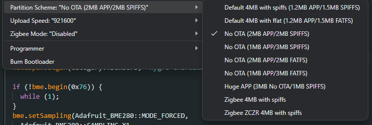

# Seeed Studio XIAO ESP32C6 & BME280 Homekit Hygro-thermometer

BME280 hygro-thermometer running on XIAO ESP32C6 compatible Homekit through [Homespan](https://github.com/HomeSpan/HomeSpan)

.JPEG>)
.JPEG>)

## Installation

### Modules
Install [`HomeSpan`](https://github.com/HomeSpan/HomeSpan) and [`Adafruit_BME280`](https://github.com/adafruit/Adafruit_BME280_Library)

### AP Configuration

Create a `define.h` file with the following informations

> [!NOTE]
> They define the AP created by Homespan when no WIFI is defined. It's not your router credential !

```c
const char* AP_SSID = "access_point_name";
const char* AP_PASSWORD = "access_point_password";
```

## 3D Model

Box : https://www.thingiverse.com/thing:6827960  
Cover : https://www.thingiverse.com/thing:4928365

## Troubleshooting

### text section exceeds available space in board

Change the partition format too something bigger.


